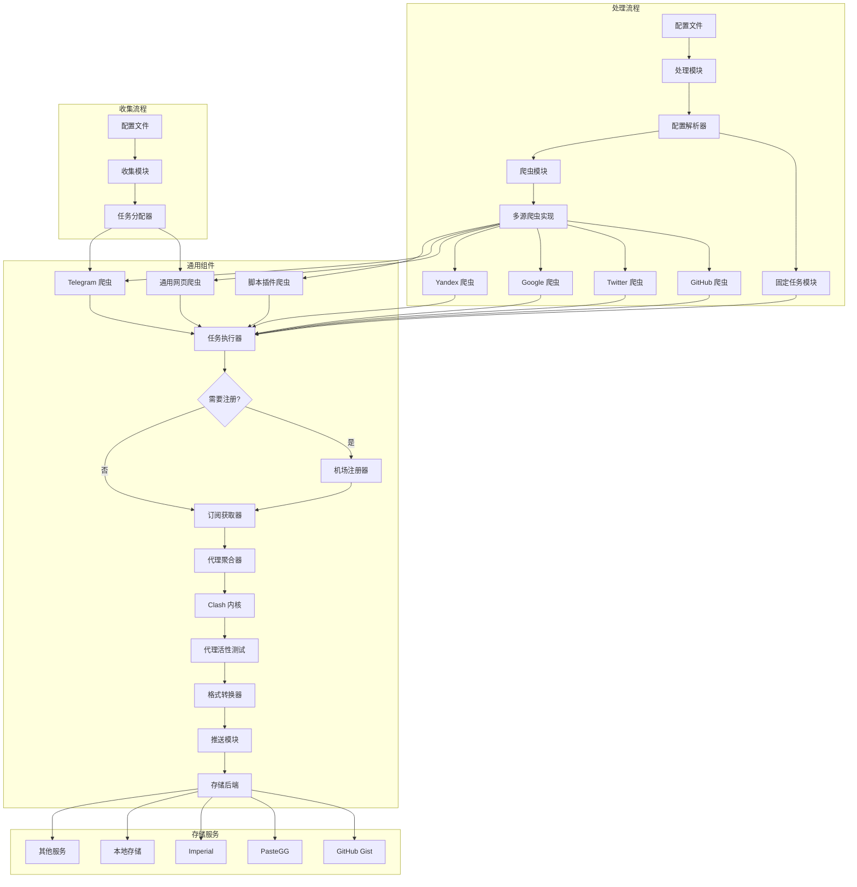
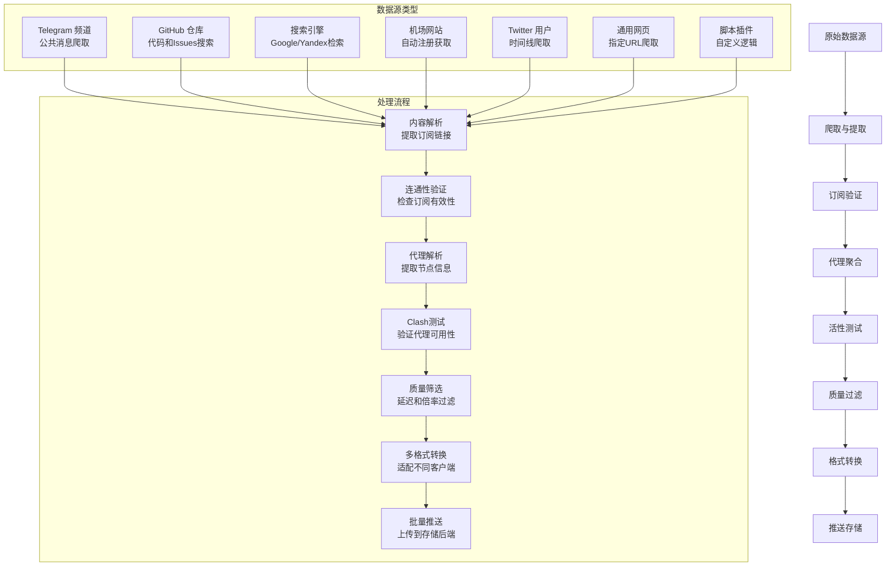
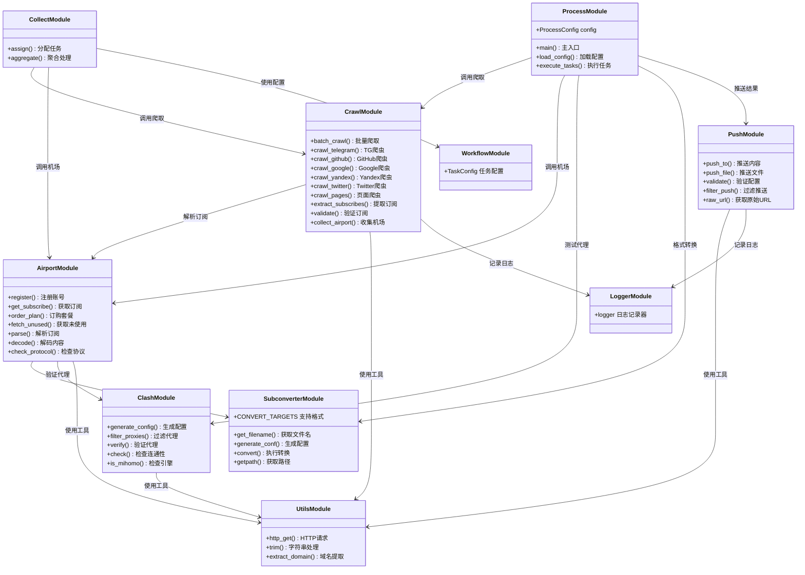
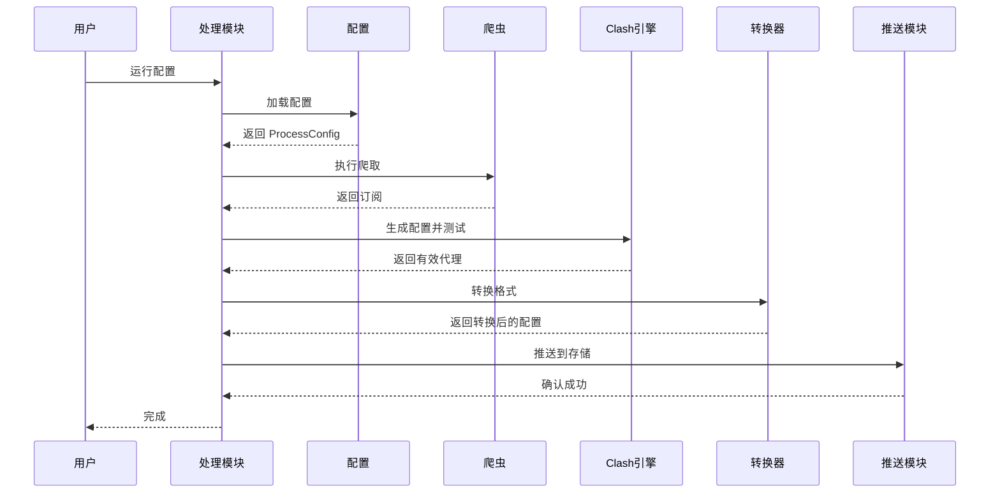
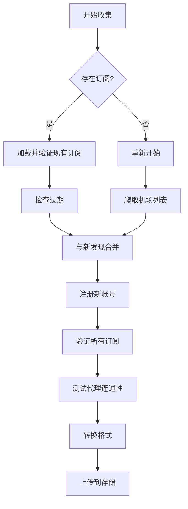
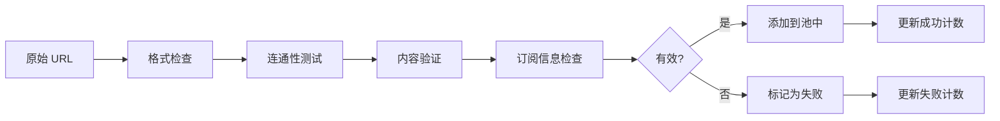
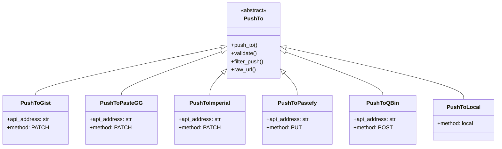

# Aggregator - 完整使用文档

## 📋 目录
- [使用指南](#使用指南)
- [快速开始](#快速开始)
- [配置详解](#配置详解)
- [故障排除](#故障排除)


## 使用指南

### 系统架构


#### 数据流图


#### 模块关系图


## 快速开始

### 系统要求
- **Python**: 3.10 或更高版本
- **操作系统**: Windows、Linux、macOS
- **网络**: 稳定的互联网连接
- **存储**: 至少 100MB 可用空间

### 安装步骤

#### 1. 获取项目
```bash
git clone https://github.com/wzdnzd/aggregator.git
cd aggregator
```

#### 2. 安装依赖
```bash
# 使用 pip 安装
pip install -r requirements.txt

# 或使用 conda
conda install --file requirements.txt
```

#### 3. 验证安装
```bash
# 检查 Python 版本
python --version

# 测试导入
python -c "import yaml, requests; print('依赖安装成功')"
```


### 获取 GitHub 令牌

1. 访问 [GitHub Settings > Personal Access Tokens](https://github.com/settings/tokens)
2. 点击 "Generate new token (classic)"
3. 设置权限：
   - `gist` - 创建和编辑 Gist
   - `repo` - 访问仓库（如需要）
4. 复制生成的 token

### 程序入口

#### process.py - 完整功能版本

**功能特点**：
- 支持复杂的配置文件
- 多源爬取和聚合
- 自定义过滤规则
- 多分组输出管理
- 支持所有存储后端

**使用方法**：
```bash
python subscribe/process.py [选项]
```

**配置加载方式**：
- 本地文件：`-s config.json`
- 远程URL：`-s https://example.com/config.json`
- 环境变量：`export SUBSCRIBE_CONF=https://example.com/config.json`

**主要参数**：
```bash
-s, --server CONFIG_FILE    # 配置文件路径（必需）
-n, --num THREADS          # 线程数（默认：64）
-r, --retry COUNT           # 重试次数（默认：3）
-t, --timeout MS            # 超时时间毫秒（默认：5000）
-c, --check                 # 仅检查代理活性
-f, --flexible              # 灵活邮箱注册模式
-o, --overwrite             # 排除剩余代理
-i, --invisible             # 隐藏进度条
-e, --environment FILE      # 环境文件（默认：.env）
-u, --url URL               # 测试URL（默认：Google 204）
```

**使用示例**：
```bash
# 基本使用
python subscribe/process.py -s config.json

# 从远程URL加载配置
python subscribe/process.py -s https://example.com/config.json

# 使用环境变量指定配置
export SUBSCRIBE_CONF=https://example.com/config.json
python subscribe/process.py

# 高性能模式
python subscribe/process.py -s config.json -n 128 -t 10000

# 仅检查模式
python subscribe/process.py -s config.json --check

# 灵活注册模式
python subscribe/process.py -s config.json --flexible
```

**process.py 专用环境变量**：
```bash
# 核心配置（必需）
PUSH_TOKEN=your_storage_token           # 存储服务令牌

# 配置文件（可选）
SUBSCRIBE_CONF=https://example.com/config.json  # 远程配置文件URL

# 工作模式控制
WORKFLOW_MODE=0                         # 0:爬取+聚合 1:仅爬取 2:仅聚合
REACHABLE=true                          # 网络连通性检测
SKIP_ALIVE_CHECK=false                  # 跳过代理活性检查
SKIP_REMARK=false                       # 跳过备注更新

# GitHub 爬虫（可选）
GH_TOKEN=your_github_token              # GitHub API 令牌（推荐）
GH_COOKIE=your_github_session_cookie    # GitHub 会话 Cookie

# 本地存储（可选）
LOCAL_BASEDIR=/path/to/output           # 本地存储基础目录
```

---

#### collect.py - 简化收集版本

**功能特点**：
- 自动收集机场网站
- 简化的命令行操作
- 直接上传到 GitHub Gist
- 适合个人快速使用

**使用方法**：
```bash
python subscribe/collect.py [选项]
```

**主要参数**：
```bash
-g, --gist USER/GIST_ID     # GitHub Gist 信息（必需）
-k, --key TOKEN             # GitHub 个人访问令牌（必需）
-t, --targets FORMAT...     # 输出格式（默认：clash,v2ray,singbox）
-n, --num THREADS           # 线程数（默认：64）
-p, --pages COUNT           # 爬取页数（默认：无限制）
-f, --flow GB               # 最小剩余流量（GB）
-l, --life HOURS            # 最小剩余时间（小时）
-d, --delay MS              # 最大延迟（默认：5000ms）
-o, --overwrite             # 覆盖域名列表
-r, --refresh               # 仅刷新现有订阅
-s, --skip                  # 跳过可用性检查
-c, --chuck                 # 丢弃需要人机验证的站点
-e, --easygoing             # 宽松注册模式
-a, --all                   # 生成完整 Clash 配置
-v, --vitiate               # 忽略默认过滤规则
-i, --invisible             # 隐藏进度条
-y, --yourself URL          # 自定义机场列表URL
-u, --url URL               # 测试URL
```

**使用示例**：
```bash
# 基本收集
python subscribe/collect.py -g username/gist_id -k your_token

# 指定输出格式
python subscribe/collect.py -g username/gist_id -k your_token -t clash v2ray

# 高质量过滤
python subscribe/collect.py -g username/gist_id -k your_token -f 50 -l 168

# 快速模式（跳过检查）
python subscribe/collect.py -g username/gist_id -k your_token --skip

# 仅刷新现有订阅
python subscribe/collect.py -g username/gist_id -k your_token --refresh

# 使用自定义机场列表
python subscribe/collect.py -g username/gist_id -k your_token -y https://example.com/list.txt
```

**collect.py 专用环境变量**：
```bash
# 核心配置（必需）
GIST_PAT=your_github_token              # GitHub 个人访问令牌
GIST_LINK=username/gist_id              # 默认 Gist 信息

# 可选配置
CUSTOMIZE_LINK=https://example.com      # 自定义机场列表URL
```

**输出格式支持**：
- `clash` - Clash 配置文件
- `v2ray` - V2Ray 订阅链接
- `singbox` - SingBox 配置文件
- `mixed` - 混合格式
- 其他 subconverter 支持的格式

---

#### 两种方式对比

| 特性       | process.py         | collect.py         |
| ---------- | ------------------ | ------------------ |
| 配置复杂度 | 高（需要配置文件） | 低（命令行参数）   |
| 功能完整性 | 完整               | 基础               |
| 自定义程度 | 高                 | 中等               |
| 学习成本   | 高                 | 低                 |
| 适用场景   | 复杂需求、定制化   | 个人使用、快速收集 |
| 存储后端   | 支持所有           | 仅 GitHub Gist     |
| 爬取源     | 可配置所有源       | 自动收集机场       |

## 配置详解

配置文件是 `process.py` 的核心，位于 `subscribe/config/config.default.json`。

### 配置文件结构概览

```json
{
    "domains": [...],      // 机场域名和订阅配置
    "crawl": {...},        // 爬虫设置和数据源配置
    "groups": {...},       // 输出分组和格式转换
    "storage": {...}       // 存储后端配置
}
```

### 1. 域名配置 (domains)

配置机场网站和订阅链接，支持自动注册和订阅管理。

#### 基本配置项

| 配置项    | 类型    | 必需性 | 默认值 | 说明                                                    |
| --------- | ------- | ------ | ------ | ------------------------------------------------------- |
| `name`    | string  | 必需   | `""`   | 机场唯一标识符，用于日志和命名                          |
| `sub`     | array   | 可选   | `[]`   | 已有订阅链接列表，配置后将跳过自动注册                  |
| `domain`  | string  | 条件   | `""`   | 机场域名，当 `sub` 为空时必需，用于自动注册获取免费套餐 |
| `enable`  | boolean | 可选   | `true` | 是否启用此配置                                          |
| `push_to` | array   | 必需   | `[]`   | 推送到的分组名称列表，不能为空                          |

#### 过滤和重命名

| 配置项     | 类型    | 必需性 | 默认值 | 说明                                 |
| ---------- | ------- | ------ | ------ | ------------------------------------ |
| `rename`   | string  | 可选   | `""`   | 节点重命名规则，支持 `{name}` 占位符 |
| `include`  | string  | 可选   | `""`   | 包含过滤器，正则表达式               |
| `exclude`  | string  | 可选   | `""`   | 排除过滤器，正则表达式               |
| `ignorede` | boolean | 可选   | `true` | 是否忽略默认排除规则                 |

#### 质量控制

| 配置项     | 类型    | 必需性 | 默认值  | 说明                             |
| ---------- | ------- | ------ | ------- | -------------------------------- |
| `liveness` | boolean | 可选   | `true`  | 是否进行活性测试                 |
| `rate`     | number  | 可选   | `2.5`   | 最大倍率，超过此值的节点将被丢弃 |
| `secure`   | boolean | 可选   | `false` | 是否要求安全连接（验证SSL证书）  |

#### 注册配置

| 配置项   | 类型   | 必需性 | 默认值 | 说明                     |
| -------- | ------ | ------ | ------ | ------------------------ |
| `count`  | number | 可选   | `2`    | 自动注册账号数量（1-10） |
| `coupon` | string | 可选   | `""`   | 注册时使用的优惠码       |

#### 高级配置 (renew)

用于配置已有账号的续费和管理：

```json
{
    "renew": {
        "account": [                    // 账号列表
            {
                "email": "user@example.com",     // 登录邮箱
                "passwd": "password123",         // 登录密码
                "ticket": {                      // 工单配置
                    "enable": true,              // 是否启用工单
                    "autoreset": false,          // 是否自动重置
                    "subject": "账号问题",       // 工单标题
                    "message": "请协助处理",     // 工单内容
                    "level": 1                   // 工单等级（1-3）
                }
            }
        ],
        "plan_id": 3,                   // 套餐ID
        "package": "免费套餐",          // 套餐名称
        "method": 1,                    // 支付方式
        "coupon_code": "NEWUSER",       // 续费优惠码
        "chatgpt": {                    // ChatGPT检测配置
            "enable": true,             // 是否启用检测
            "regex": "ChatGPT|OpenAI",  // 检测关键词
            "operate": "IN"             // 操作类型（IN/OUT）
        }
    }
}
```

#### 完整示例

```json
{
    "domains": [
        {
            "name": "example-airport",
            "sub": ["https://example.com/api/v1/client/subscribe?token=abc123"],
            "domain": "example.com",
            "enable": true,
            "rename": "🚀 {name}",
            "include": "香港|新加坡|美国",
            "exclude": "过期|失效|测试",
            "push_to": ["premium", "backup"],
            "ignorede": true,
            "liveness": true,
            "rate": 2.0,
            "count": 3,
            "coupon": "FREE2024",
            "secure": false
        }
    ]
}
```

### 2. 爬虫配置 (crawl)

爬虫模块负责从各种数据源自动收集代理订阅。

#### 2.1 全局设置

| 配置项       | 类型    | 必需性 | 默认值 | 说明                       |
| ------------ | ------- | ------ | ------ | -------------------------- |
| `enable`     | boolean | 可选   | `true` | 是否启用爬虫功能           |
| `exclude`    | string  | 可选   | `""`   | 全局排除规则（正则表达式） |
| `threshold`  | number  | 可选   | `5`    | 失败阈值，超过此值停止尝试 |
| `singlelink` | boolean | 可选   | `true` | 是否允许单个代理链接       |

#### 持久化配置 (persist)

| 配置项    | 类型   | 必需性 | 默认值             | 说明             |
| --------- | ------ | ------ | ------------------ | ---------------- |
| `subs`    | string | 可选   | `"crawledsubs"`    | 订阅数据存储键名 |
| `proxies` | string | 可选   | `"crawledproxies"` | 代理数据存储键名 |

#### 通用配置 (config)

应用于所有爬取源的默认配置：

```json
{
    "config": {
        "rename": "🌐 {name}",          // 默认重命名规则
        "include": "",                  // 默认包含规则
        "exclude": "测试|过期"          // 默认排除规则
    }
}
```

#### 2.2 Telegram 爬虫

从 Telegram 公共频道爬取订阅链接。

**全局配置**：

| 配置项    | 类型    | 必需性 | 默认值 | 说明                   |
| --------- | ------- | ------ | ------ | ---------------------- |
| `enable`  | boolean | 可选   | `true` | 是否启用 Telegram 爬虫 |
| `pages`   | number  | 可选   | `5`    | 每个频道爬取的页数     |
| `exclude` | string  | 可选   | `""`   | 频道级别的排除规则     |

**频道配置 (users)**：

每个频道的具体配置：

```json
{
    "users": {
        "频道名称": {
            "include": "订阅|vmess|trojan",    // 包含关键词
            "exclude": "付费|广告",            // 排除关键词
            "config": {                        // 频道专用配置
                "rename": "📱 TG-{name}"
            },
            "push_to": ["free"]               // 推送到的分组
        }
    }
}
```

**示例配置**：

```json
{
    "telegram": {
        "enable": true,
        "pages": 3,
        "exclude": "spam|ads",
        "users": {
            "proxy_channel": {
                "include": "订阅|subscription|免费",
                "exclude": "付费|vip|premium",
                "push_to": ["free"]
            },
            "premium_channel": {
                "include": "高级|premium",
                "exclude": "广告",
                "push_to": ["premium"]
            }
        }
    }
}
```

#### 2.3 GitHub 爬虫

从 GitHub 代码和 Issues 中搜索订阅链接。

| 配置项    | 类型    | 必需性 | 默认值 | 说明                 |
| --------- | ------- | ------ | ------ | -------------------- |
| `enable`  | boolean | 可选   | `true` | 是否启用 GitHub 爬虫 |
| `pages`   | number  | 可选   | `2`    | 搜索结果页数         |
| `push_to` | array   | 必需   | `[]`   | 推送到的分组列表     |
| `exclude` | string  | 可选   | `""`   | 排除规则             |
| `spams`   | array   | 可选   | `[]`   | 排除的仓库名称列表   |

**环境变量**：
```bash
# 方式一：GitHub 会话 Cookie（网页搜索）
GH_COOKIE=user_session_xxxxxxxxxx

# 方式二：GitHub API 令牌（推荐）
GH_TOKEN=ghp_xxxxxxxxxxxxxxxxxxxx
```

**示例配置**：
```json
{
    "github": {
        "enable": true,
        "pages": 3,
        "push_to": ["free"],
        "exclude": "test|demo|example",
        "spams": ["spam-repo", "fake-proxy"]
    }
}
```

#### 2.4 搜索引擎爬虫

**Google 搜索**：

| 配置项     | 类型    | 必需性 | 默认值  | 说明                 |
| ---------- | ------- | ------ | ------- | -------------------- |
| `enable`   | boolean | 可选   | `false` | 是否启用（默认禁用） |
| `exclude`  | string  | 可选   | `""`    | 排除规则             |
| `limits`   | number  | 可选   | `100`   | 最大搜索结果数       |
| `notinurl` | array   | 可选   | `[]`    | 排除的域名列表       |
| `push_to`  | array   | 必需   | `[]`    | 推送到的分组         |

**Yandex 搜索**：

| 配置项     | 类型    | 必需性 | 默认值  | 说明                 |
| ---------- | ------- | ------ | ------- | -------------------- |
| `enable`   | boolean | 可选   | `false` | 是否启用（默认禁用） |
| `exclude`  | string  | 可选   | `""`    | 排除规则             |
| `within`   | number  | 可选   | `3`     | 搜索时间范围（天）   |
| `pages`    | number  | 可选   | `5`     | 搜索页数             |
| `notinurl` | array   | 可选   | `[]`    | 排除的域名列表       |
| `push_to`  | array   | 必需   | `[]`    | 推送到的分组         |

**示例配置**：
```json
{
    "google": {
        "enable": false,
        "exclude": "spam|blocked",
        "limits": 50,
        "notinurl": ["spam.com", "blocked.site"],
        "push_to": ["free"]
    },
    "yandex": {
        "enable": false,
        "exclude": "spam",
        "within": 7,
        "pages": 3,
        "notinurl": ["spam.com"],
        "push_to": ["free"]
    }
}
```

#### 2.5 Twitter 爬虫

从 Twitter 用户时间线爬取代理链接。

**全局配置**：

| 配置项   | 类型    | 必需性 | 默认值 | 说明                  |
| -------- | ------- | ------ | ------ | --------------------- |
| `enable` | boolean | 可选   | `true` | 是否启用 Twitter 爬虫 |

**用户配置 (users)**：

```json
{
    "users": {
        "用户名": {
            "enable": true,              // 是否启用此用户
            "num": 30,                   // 检查的推文数量
            "include": "proxy|vpn|节点", // 包含关键词
            "exclude": "广告|付费",      // 排除关键词
            "config": {                  // 用户专用配置
                "rename": "🐦 Twitter-{name}"
            },
            "push_to": ["free"]         // 推送到的分组
        }
    }
}
```

#### 2.6 仓库爬虫 (repositories)

从指定 GitHub 仓库的提交记录中爬取。

| 配置项      | 类型    | 必需性 | 默认值  | 说明           |
| ----------- | ------- | ------ | ------- | -------------- |
| `enable`    | boolean | 可选   | `false` | 是否启用此仓库 |
| `username`  | string  | 必需   | `""`    | GitHub 用户名  |
| `repo_name` | string  | 必需   | `""`    | 仓库名称       |
| `commits`   | number  | 可选   | `3`     | 检查的提交数量 |
| `exclude`   | string  | 可选   | `""`    | 排除规则       |
| `push_to`   | array   | 必需   | `[]`    | 推送到的分组   |

**示例配置**：
```json
{
    "repositories": [
        {
            "enable": true,
            "username": "proxy-user",
            "repo_name": "free-proxy-list",
            "commits": 5,
            "exclude": "test|demo",
            "push_to": ["free"]
        }
    ]
}
```

#### 2.7 自定义页面爬虫 (pages)

从指定网页爬取代理链接。

**基本配置**：

| 配置项    | 类型         | 必需性 | 默认值 | 说明                    |
| --------- | ------------ | ------ | ------ | ----------------------- |
| `enable`  | boolean      | 可选   | `true` | 是否启用此页面          |
| `url`     | string/array | 必需   | `""`   | 目标URL，支持单个或多个 |
| `include` | string       | 可选   | `""`   | 包含规则（正则）        |
| `exclude` | string       | 可选   | `""`   | 排除规则（正则）        |
| `push_to` | array        | 必需   | `[]`   | 推送到的分组            |

**批量页面配置**：

| 配置项        | 类型    | 必需性 | 默认值 | 说明           |
| ------------- | ------- | ------ | ------ | -------------- |
| `multiple`    | boolean | 可选   | `true` | 是否为批量页面 |
| `placeholder` | string  | 条件   | `""`   | URL中的占位符  |
| `start`       | number  | 可选   | `1`    | 起始页码       |
| `end`         | number  | 可选   | `10`   | 结束页码       |

**示例配置**：
```json
{
    "pages": [
        {
            "enable": true,
            "url": "https://example.com/proxies",
            "include": "vmess://|trojan://|ss://",
            "exclude": "过期|失效",
            "config": {
                "rename": "🌍 Web-{name}"
            },
            "push_to": ["free"]
        },
        {
            "enable": true,
            "url": "https://example.com/page/{page}",
            "multiple": true,
            "placeholder": "{page}",
            "start": 1,
            "end": 5,
            "push_to": ["free"]
        }
    ]
}
```

#### 2.8 脚本爬虫 (scripts) - 插件系统

通过自定义 Python 脚本扩展爬取功能。

| 配置项   | 类型    | 必需性 | 默认值  | 说明                            |
| -------- | ------- | ------ | ------- | ------------------------------- |
| `enable` | boolean | 可选   | `false` | 是否启用此脚本                  |
| `script` | string  | 必需   | `""`    | 脚本路径，格式：`文件名#函数名` |
| `params` | object  | 可选   | `{}`    | 传递给脚本的参数                |

**参数配置 (params)**：

```json
{
    "params": {
        "persist": {                    // 持久化配置
            "fileid": "custom_output"   // 存储文件ID
        },
        "api_key": "任意需要的配置",     // 自定义参数，可以是任意键值对
        "timeout": 30,                  // 其他自定义配置
        "config": {                     // 通用配置
            "enable": true,
            "liveness": true,
            "exclude": "test|spam",
            "rename": "🔧 Custom-{name}",
            "push_to": ["premium"]
        }
    }
}
```

**脚本开发示例**：

创建 `scripts/custom_crawler.py`：

```python
def main_function(params):
    """
    自定义爬虫函数
    
    Args:
        params: 配置参数字典
        
    Returns:
        list: 返回订阅配置列表
    """
    api_key = params.get("api_key")           # 获取自定义配置
    custom_param = params.get("custom_param") # 获取其他参数
    config = params.get("config", {})
    
    # 你的爬取逻辑
    subscriptions = []
    
    # 返回格式
    return [
        {
            "name": "custom-source",
            "sub": "https://example.com/subscribe",
            "push_to": config.get("push_to", []),
            "saved": False  # 是否已保存
        }
    ]
```

**完整示例**：
```json
{
    "scripts": [
        {
            "enable": true,
            "script": "custom_crawler#main_function",
            "params": {
                "persist": {
                    "fileid": "custom_output"
                },
                "api_key": "任意需要的配置值",
                "custom_param": "其他参数",
                "config": {
                    "enable": true,
                    "liveness": true,
                    "exclude": "test|demo",
                    "rename": "🔧 API-{name}",
                    "push_to": ["premium"]
                }
            }
        }
    ]
}
```

### 3. 分组配置 (groups)

定义输出分组，控制代理的分类和格式转换。

#### 基本配置

| 配置项  | 类型    | 必需性 | 默认值 | 说明                      |
| ------- | ------- | ------ | ------ | ------------------------- |
| `emoji` | boolean | 可选   | `true` | 是否添加国家/地区表情符号 |
| `list`  | boolean | 可选   | `true` | 是否生成节点列表模式      |

#### 输出目标 (targets)

定义此分组要生成的格式及对应的存储配置。键名必须是 [subconverter](https://github.com/asdlokj1qpi233/subconverter) 支持的格式：

**常用格式**：

| 格式键名  | 说明                     | 适用客户端                |
| --------- | ------------------------ | ------------------------- |
| `clash`   | Clash 配置文件           | Clash for Windows, ClashX |
| `v2ray`   | V2Ray 订阅链接（Base64） | V2RayN, V2RayNG           |
| `singbox` | SingBox 配置文件         | SingBox                   |
| `mixed`   | 混合格式                 | 多种客户端                |
| `ss`      | Shadowsocks 格式         | SS 客户端                 |
| `ssr`     | ShadowsocksR 格式        | SSR 客户端                |

**完整支持列表**：参见 [subconverter 文档](https://github.com/asdlokj1qpi233/subconverter#supported-types)

#### 地理位置规范化 (regularize)

| 配置项        | 类型    | 必需性 | 默认值  | 说明                               |
| ------------- | ------- | ------ | ------- | ---------------------------------- |
| `enable`      | boolean | 可选   | `false` | 是否启用位置规范化                 |
| `locate`      | boolean | 可选   | `true`  | 是否检测节点的落地所在地区/国家    |
| `residential` | boolean | 可选   | `true`  | 是否检测节点类型是否为家庭宽带类型 |
| `bits`        | number  | 可选   | `2`     | 用几位数字填充节点名               |

#### 完整示例

```json
{
    "groups": {
        "premium": {
            "emoji": true,
            "list": true,
            "targets": {
                "clash": "premium-clash",
                "v2ray": "premium-v2ray",
                "singbox": "premium-singbox"
            },
            "regularize": {
                "enable": true,
                "locate": true,
                "residential": false,
                "bits": 2
            }
        },
        "free": {
            "emoji": true,
            "list": false,
            "targets": {
                "clash": "free-clash",
                "v2ray": "free-v2ray"
            }
        },
        "backup": {
            "emoji": false,
            "list": true,
            "targets": {
                "singbox": "backup-singbox"
            }
        }
    }
}
```

### 4. 存储配置 (storage)

配置输出文件的存储后端，支持多种云存储服务。

#### 全局配置

| 配置项   | 类型   | 必需性 | 默认值  | 说明         |
| -------- | ------ | ------ | ------- | ------------ |
| `engine` | string | 必需   | `"xxx"` | 存储引擎类型 |
| `base`   | string | 可选   | `""`    | API 基础URL  |
| `domain` | string | 可选   | `""`    | 服务域名     |
| `items`  | object | 必需   | `{}`    | 存储项配置   |

#### 支持的存储引擎

| 引擎       | 说明        | 免费额度 | 推荐度 |
| ---------- | ----------- | -------- | ------ |
| `gist`     | GitHub Gist | 无限制   | ⭐⭐⭐⭐⭐  |
| `pastegg`  | Paste.gg    | 有限制   | ⭐⭐⭐⭐   |
| `imperial` | ImperialBin | 有限制   | ⭐⭐⭐    |
| `pastefy`  | Pastefy.app | 有限制   | ⭐⭐⭐    |
| `qbin`     | QBin.me     | 有限制   | ⭐⭐     |
| `local`    | 本地存储    | 无限制   | ⭐⭐⭐⭐   |

#### 4.1 GitHub Gist（推荐）

**优点**：免费、稳定、无限制、支持版本控制
**缺点**：需要 GitHub 账号

```json
{
    "storage": {
        "engine": "gist",
        "items": {
            "premium-clash": {
                "username": "your-github-username",
                "gistid": "your-gist-id",
                "filename": "premium-clash.yaml"
            }
        }
    }
}
```

**必需环境变量**：
```bash
PUSH_TOKEN=ghp_xxxxxxxxxxxxxxxxxxxx  # GitHub 个人访问令牌
```

**获取 Gist ID**：
1. 访问 [GitHub Gist](https://gist.github.com)
2. 创建新的 Gist
3. 从 URL 中获取 ID：`https://gist.github.com/username/【这里是ID】`

#### 4.2 PasteGG 存储

**优点**：支持文件夹组织、API 稳定
**缺点**：需要注册、有使用限制

```json
{
    "storage": {
        "engine": "pastegg",
        "base": "https://api.paste.gg",
        "domain": "https://paste.gg",
        "items": {
            "premium-clash": {
                "username": "your-username",
                "folderid": "folder-id",
                "fileid": "file-id"
            }
        }
    }
}
```

**必需环境变量**：
```bash
PUSH_TOKEN=your_pastegg_api_key
```

**获取配置信息**：
1. 注册 [Paste.gg](https://paste.gg) 账号
2. 获取 API Key
3. 创建文件夹和文件，记录 ID

#### 4.3 Imperial 存储

**优点**：简单易用、支持密码保护
**缺点**：有文件大小限制

```json
{
    "storage": {
        "engine": "imperial",
        "base": "https://api.imperialb.in",
        "domain": "https://imperialb.in",
        "items": {
            "premium-clash": {
                "fileid": "document-id"
            }
        }
    }
}
```

**必需环境变量**：
```bash
PUSH_TOKEN=your_imperial_api_token
```

#### 4.4 Pastefy 存储

**优点**：现代化界面、API 友好
**缺点**：相对较新的服务

```json
{
    "storage": {
        "engine": "pastefy",
        "base": "https://pastefy.app",
        "items": {
            "premium-clash": {
                "fileid": "paste-id"
            }
        }
    }
}
```

**必需环境变量**：
```bash
PUSH_TOKEN=your_pastefy_api_token
```

#### 4.5 QBin 存储

**优点**：支持密码和过期时间
**缺点**：功能相对简单

```json
{
    "storage": {
        "engine": "qbin",
        "base": "https://qbin.me",
        "items": {
            "premium-clash": {
                "fileid": "file-id",
                "password": "optional-password",
                "expire": 86400
            }
        }
    }
}
```

**配置说明**：
- `password`: 可选，访问密码
- `expire`: 可选，过期时间（秒）

**必需环境变量**：
```bash
PUSH_TOKEN=your_qbin_token
```

#### 4.6 本地存储

**优点**：完全控制、无限制、高速
**缺点**：需要自行处理文件分发

```json
{
    "storage": {
        "engine": "local",
        "items": {
            "premium-clash": {
                "folderid": "output/premium",
                "fileid": "clash.yaml"
            }
        }
    }
}
```

**可选环境变量**：
```bash
LOCAL_BASEDIR=/path/to/output/directory  # 基础输出目录
```

**文件路径**：
- 绝对路径：`/path/to/output/directory/output/premium/clash.yaml`
- 相对路径：`./output/premium/clash.yaml`（相对于项目根目录）

#### 存储配置最佳实践

1. **推荐组合**：
   ```json
   {
       "storage": {
           "engine": "gist",
           "items": {
               "premium-clash": {"username": "user", "gistid": "id1", "filename": "premium.yaml"},
               "free-clash": {"username": "user", "gistid": "id2", "filename": "free.yaml"},
               "crawledsubs": {"username": "user", "gistid": "id3", "filename": "subs.json"}
           }
       }
   }
   ```

2. **多后端备份**：
   - 主要使用 GitHub Gist
   - 本地存储作为备份
   - 关键配置使用多个 Gist 分散存储

3. **安全建议**：
   - 定期轮换 API Token
   - 使用专用的 GitHub 账号
   - 避免在公共 Gist 中存储敏感信息


### 核心模块

#### 处理模块 (`process.py`)
主要的协调器，处理完整的工作流程：

**工作流程序列**


#### 命令行使用
```bash
# 基本使用
python subscribe/process.py -s config.json

# 自定义参数
python subscribe/process.py \
    -s config.json \
    -n 32 \              # 32 线程
    -r 5 \               # 5 次重试
    -t 10000 \           # 10秒超时
    --flexible \         # 灵活邮箱注册
    --invisible          # 隐藏进度条
```

#### 主要参数
- `-s, --server`: 配置文件路径或 URL
- `-n, --num`: 处理线程数（默认：64）
- `-r, --retry`: 失败请求重试次数（默认：3）
- `-t, --timeout`: 超时时间，毫秒（默认：5000）
- `-c, --check`: 仅检查代理活性，不处理
- `-f, --flexible`: 使用 Gmail 别名进行注册
- `-o, --overwrite`: 排除之前运行的剩余代理
- `-i, --invisible`: 隐藏进度指示器

#### 收集模块 (`collect.py`)
用于收集和管理机场订阅的简化工具：

#### 使用流程


#### 命令行使用
```bash
# 基本收集
python subscribe/collect.py -g username/gist-id -k your-token

# 高级选项
python subscribe/collect.py \
    -g username/gist-id \
    -k your-token \
    -t clash v2ray singbox \  # 输出格式
    -n 32 \                   # 线程数
    -p 10 \                   # 最大爬取页数
    -f 50 \                   # 最小剩余流量（GB）
    -l 168 \                  # 最小剩余时间（小时）
    --overwrite \             # 覆盖域名列表
    --refresh                 # 仅刷新现有订阅
```

#### 爬虫模块 (`crawl.py`)
处理多源爬取和订阅验证：

#### 爬取源
1. **Telegram 频道**: 爬取公共 Telegram 频道的订阅链接
2. **GitHub**: 在代码和问题中搜索订阅 URL
3. **Google/Yandex**: 搜索引擎爬取订阅模式
4. **Twitter**: 爬取用户时间线的代理链接
5. **自定义页面**: 使用自定义模式直接爬取页面
6. **脚本**: 专门爬取的自定义插件系统

#### 验证过程


#### 推送模块 (`push.py`)
管理输出到各种存储后端：

#### 存储后端架构


### 使用示例

#### 基本工作流程
1. **准备配置**
```bash
cp subscribe/config/config.default.json my-config.json
# 编辑 my-config.json 设置您的配置
```

2. **运行处理**
```bash
python subscribe/process.py -s my-config.json
```

3. **检查结果**
处理后的配置将上传到您配置的存储后端。

#### 高级场景

**场景 1: 仅爬取模式**
```bash
# 设置环境变量
export WORKFLOW_MODE=1

# 仅运行爬取
python subscribe/process.py -s config.json
```

**场景 2: 自定义机场收集**
```bash
# 从自定义源收集
python subscribe/collect.py \
    -y https://your-airport-list.com \
    -g username/gist-id \
    -k your-token
```

**场景 3: 定时自动化**
```bash
#!/bin/bash
# cron-job.sh

# 设置环境
export WORKFLOW_MODE=0
export SKIP_ALIVE_CHECK=false

# 运行处理
cd /path/to/aggregator
python subscribe/process.py -s my-config.json

# 记录结果
echo "$(date): 处理完成" >> /var/log/aggregator.log
```

**场景 4: 多分组配置**
```json
{
    "groups": {
        "premium": {
            "targets": {
                "clash": "premium-clash",
                "v2ray": "premium-v2ray"
            }
        },
        "free": {
            "targets": {
                "clash": "free-clash"
            }
        },
        "backup": {
            "targets": {
                "singbox": "backup-singbox"
            }
        }
    }
}
```

### 最佳实践

#### 性能优化
1. **线程配置**
   - 使用 32-64 线程以获得最佳性能
   - 根据系统资源和网络容量进行调整

2. **爬取效率**
   - 仅启用必要的爬取源
   - 为 Telegram/GitHub 爬取使用适当的页面限制
   - 设置合理的超时和重试限制

3. **存储管理**
   - 为您的规模使用适当的存储后端
   - 考虑本地存储用于高频更新
   - 实施适当的备份策略

#### 安全考虑
1. **凭据管理**
   - 在环境变量中存储敏感令牌
   - 使用具有最小权限的专用服务账户
   - 定期轮换访问令牌

2. **网络安全**
   - 对所有外部通信使用 HTTPS
   - 验证 SSL 证书（设置 `secure: true`）
   - 实施速率限制以避免被阻止

3. **数据隐私**
   - 注意数据保留政策
   - 避免记录敏感信息
   - 尊重 robots.txt 和服务条款

#### 资源管理
1. **内存使用**
   - 在大型爬取操作期间监控内存消耗
   - 对大型数据集使用流处理
   - 实施适当的清理程序

2. **网络资源**
   - 对失败的请求实施指数退避
   - 尽可能使用连接池
   - 监控带宽使用

3. **存储配额**
   - 监控存储后端配额和限制
   - 为旧数据实施轮换策略
   - 在适当的地方使用压缩

## 故障排除

### 常见问题

**配置错误**
```bash
# 错误：无效配置
# 解决方案：验证 JSON 语法
python -m json.tool config.json

# 错误：缺少存储配置
# 解决方案：确保所有引用的存储键都存在于 storage.items 中
```

**网络问题**
```bash
# 错误：连接超时
# 解决方案：增加超时值
python subscribe/process.py -s config.json -t 15000

# 错误：速率限制
# 解决方案：减少线程数并添加延迟
python subscribe/process.py -s config.json -n 16
```

**存储问题**
```bash
# 错误：身份验证失败
# 解决方案：检查令牌有效性和权限
export PUSH_TOKEN=your_valid_token

# 错误：配额超出
# 解决方案：清理旧文件或升级存储计划
```

### 调试与日志
启用详细日志记录：
```bash
# 设置日志级别
export LOG_LEVEL=DEBUG

# 运行详细输出
python subscribe/process.py -s config.json --invisible=false
```

**日志分析**
检查日志中的常见模式：
```bash
# 检查失败的订阅
grep "cannot fetch any proxy" logs/aggregator.log

# 检查存储问题
grep "PushError" logs/aggregator.log

# 检查爬取问题
grep "CrawlError" logs/aggregator.log
```

