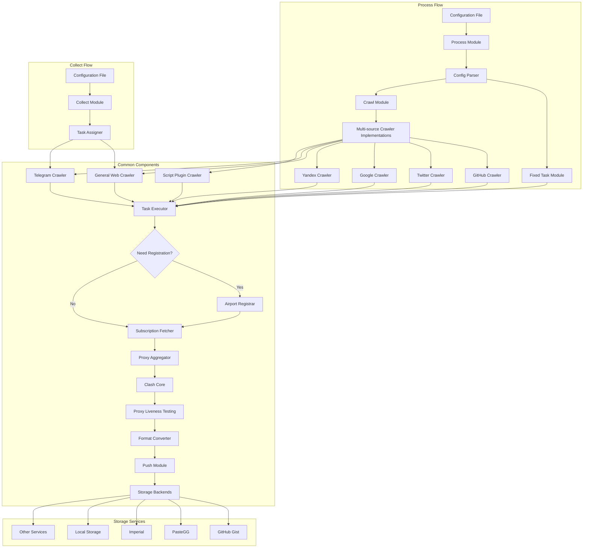
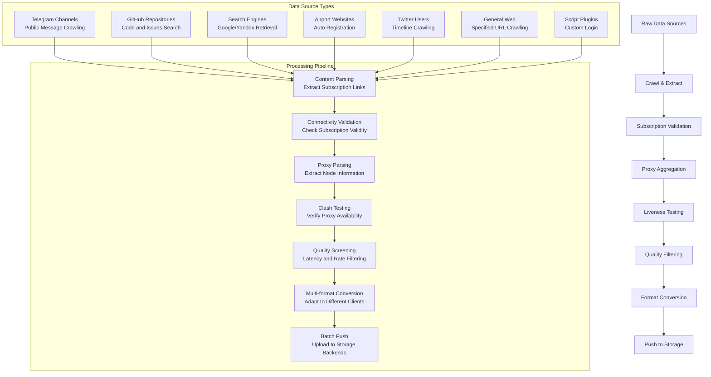
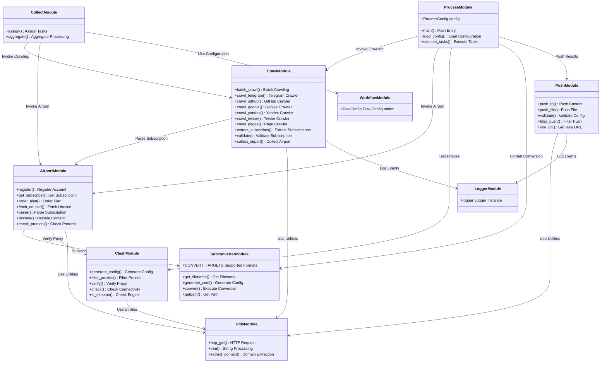
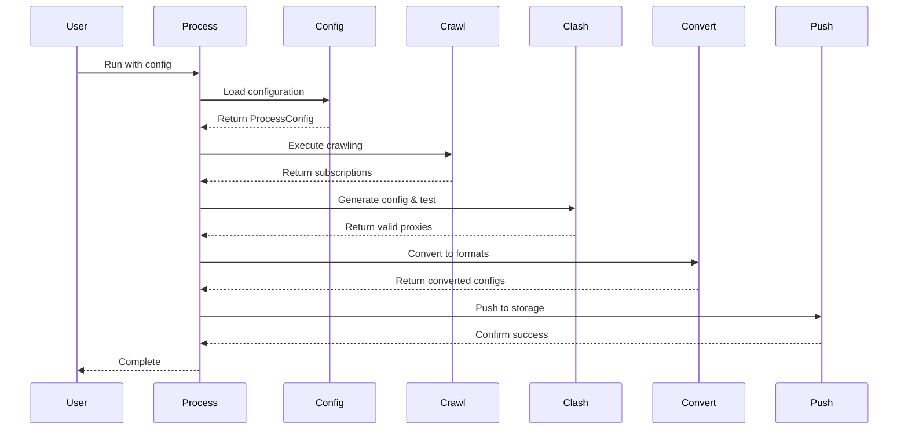
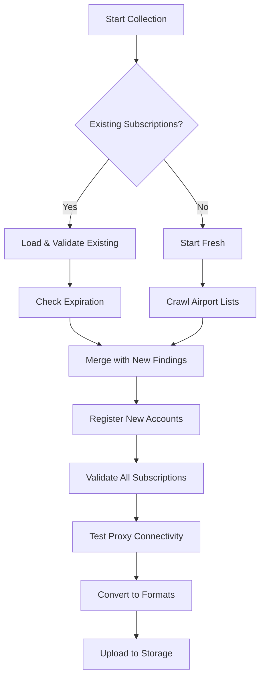
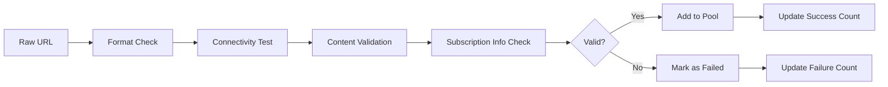
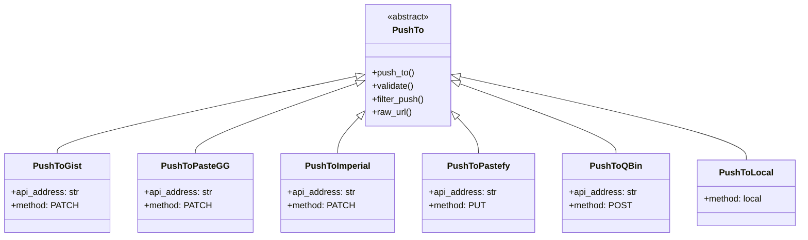

# Aggregator - Free Proxy Pool Builder

## Table of Contents
- [Usage Guide](#usage-guide)
- [Quick Start](#quick-start)
- [Configuration Guide](#configuration-guide)
- [Troubleshooting](#troubleshooting)


## Usage Guide

### System Architecture

#### Overall Architecture


#### Data Flow Diagram


#### Module Relationships


## Quick Start

### Prerequisites
```bash
# Install Python 3.10+
python --version

# Install required system packages
sudo apt-get update
sudo apt-get install git curl wget
```

### Installation Steps
1. **Clone the repository**
```bash
git clone https://github.com/wzdnzd/aggregator.git
cd aggregator
```

2. **Install dependencies**
```bash
pip install -r requirements.txt
```

3. **Download required binaries**
```bash
# The system will automatically download clash and subconverter binaries
# Or manually place them in the appropriate directories
```

### Environment Configuration
Create a `.env` file in the project root:
```bash
# Storage configuration
PUSH_TOKEN=your_storage_token_here

# GitHub credentials (optional)
GH_TOKEN=your_github_token
GH_COOKIE=your_github_session_cookie

# Gist configuration (for collect.py)
GIST_PAT=your_github_personal_access_token
GIST_LINK=username/gist_id

# Workflow mode (0: crawl+aggregate, 1: crawl only, 2: aggregate only)
WORKFLOW_MODE=0

# Network settings
REACHABLE=true
SKIP_ALIVE_CHECK=false
SKIP_REMARK=false

# Custom settings
CUSTOMIZE_LINK=https://your-custom-airport-list.com
```

## Configuration Guide

### Configuration File Structure
The main configuration file is located at `subscribe/config/config.default.json`. Here's the complete structure:

```json
{
    "domains": [...],      // Domain/subscription configurations
    "crawl": {...},        // Crawling settings
    "groups": {...},       // Output group configurations  
    "storage": {...}       // Storage backend settings
}
```

### 1. Domain Configuration (domains)
Configure specific airport websites or subscription links:

```json
{
    "domains": [
        {
            "name": "example-site",           // Unique identifier
            "sub": ["https://sub1.com"],      // Existing subscription URLs, will skip auto-registration if configured
            "domain": "example.com",          // Airport domain, will attempt auto-registration for free plans when sub is empty and domain is valid
            "enable": true,                   // Enable/disable this config
            "rename": "🚀 {name}",           // Rename pattern for proxies
            "include": "regex_pattern",       // Include filter (regex)
            "exclude": "regex_pattern",       // Exclude filter (regex)
            "push_to": ["group1", "group2"], // Target groups
            "ignorede": true,                 // Ignore default exclude rules
            "liveness": true,                 // Enable liveness testing
            "rate": 2.5,                     // Max rate multiplier
            "count": 2,                      // Number of accounts to register
            "coupon": "FREECODE",            // Coupon code
            "secure": false,                 // Require secure connections
            "renew": {                       // Account renewal settings
                "account": [
                    {
                        "email": "user@example.com",
                        "passwd": "password123",
                        "ticket": {
                            "enable": true,
                            "autoreset": false,
                            "subject": "Account Issue",
                            "message": "Please help",
                            "level": 1
                        }
                    }
                ],
                "plan_id": 3,
                "package": "free",
                "method": 1,
                "coupon_code": "DISCOUNT",
                "chatgpt": {
                    "enable": true,
                    "regex": "ChatGPT|OpenAI",
                    "operate": "IN"
                }
            }
        }
    ]
}
```

### 2. Crawling Configuration (crawl)

#### 2.1 Global Crawling Settings

```json
{
    "crawl": {
        "enable": true,                    // Enable crawling
        "exclude": "spam|blocked",         // Global exclude pattern
        "threshold": 5,                    // Max failure threshold
        "singlelink": true,               // Allow single proxy links
        "persist": {                      // Persistence settings
            "subs": "crawledsubs",        // Subscription storage key
            "proxies": "crawledproxies"   // Proxy storage key
        },
        "config": {                       // Global crawl config
            "rename": "🌐 {name}",
            "include": "",
            "exclude": ""
        },
        
#### 2.2 Telegram Crawler

```json
{
    "telegram": {
            "enable": true,
            "pages": 5,                   // Pages to crawl per channel
            "exclude": "spam|ads",
            "users": {
                "channel_name": {
                    "include": "subscription|sub",
                    "exclude": "spam",
                    "config": {
                        "rename": "📱 TG-{name}"
                    },
                    "push_to": ["group1"]
                }
            }
        }
    }
}
```

#### 2.3 GitHub Crawler

```json
{
    "github": {
        "enable": true,
        "pages": 2,                       // Search pages
        "push_to": ["free"],
        "exclude": "test|spam",
        "spams": ["spam-repo"]            // Excluded repositories
    }
}
```

**process.py Environment Variables:**
```bash
# GitHub Cookie (web search)
GH_COOKIE=your_github_session_cookie

# GitHub Token (API search, recommended)
GH_TOKEN=your_github_token
```

#### 2.4 Google/Yandex Search Crawler

```json
{
    "google": {
            "enable": false,              // Disabled by default
            "exclude": "spam",
            "notinurl": ["spam.com"],     // Exclude domains
            "qdr": 7,                     // Days to search back
            "limits": 100,                // Max results
            "push_to": ["group1"]
    },
    "yandex": {
        "enable": false,
        "within": 2,                     // Time range (days)
        "pages": 5,                      // Search pages
        "push_to": ["free"]
    }
}
```

#### 2.5 Twitter Crawler

```json
{
    "twitter": {
            "enable": true,
            "users": {
                "username": {
                    "enable": true,
                    "num": 30,            // Number of tweets to check
                    "include": "proxy|vpn",
                    "exclude": "spam",
                    "push_to": ["group1"]
                }
            }
        }
    }
}
```

#### 2.6 Custom Page Crawler

```json
{
    "pages": [
            {
                "enable": true,
                "url": "https://example.com/proxies",
                "include": "vmess://|trojan://",
                "exclude": "expired",
                "config": {
                    "rename": "🌍 {name}"
                },
                "push_to": ["group1"]
            }
    ]
}
```

#### 2.7 Script Crawler (Plugin System)

```json
{
    "scripts": [
            {
                "enable": false,
                "script": "custom_crawler#main_function",
                "params": {
                    "persist": {
                        "fileid": "custom_output"
                    },
                    "config": {
                        "enable": true,
                        "liveness": true,
                        "exclude": "spam",
                        "rename": "🔧 {name}",
                        "push_to": ["group1"]
                    }
                }
            }
        ]
    }
}
```

### 3. Group Configuration (groups)

Define output groups and format conversion:

```json
{
    "groups": {
        "premium": {                      // Group name
            "emoji": true,                // Add country emojis
            "list": true,                 // Generate proxy list
            "targets": {                  // Output formats (keys must be supported by subconverter: https://github.com/asdlokj1qpi233/subconverter)
                "clash": "premium-clash",     // Storage key for Clash format
                "singbox": "premium-singbox", // Storage key for SingBox format
                "v2ray": "premium-v2ray"      // Storage key for V2Ray format
            },
            "regularize": {               // Location regularization
                "enable": false,
                "locate": true,           // Whether to detect node's landing region/country
                "residential": false,     // Whether to detect if node type is residential broadband
                "bits": 2                 // Number of digits to pad node names
            }
        },
        "free": {
            "emoji": true,
            "list": false,
            "targets": {
                "clash": "free-clash",
                "v2ray": "free-v2ray"
            }
        }
    }
}
```

### 4. Storage Configuration (storage)

#### 4.1 GitHub Gist Storage

```json
{
    "storage": {
        "engine": "gist",
        "items": {
            "premium-clash": {
                "username": "github-username",
                "gistid": "gist-id",
                "filename": "clash.yaml"
            }
        }
    }
}
```

**Required Environment Variables:**
```bash
PUSH_TOKEN=your_github_personal_access_token
```

#### 4.2 PasteGG Storage

```json
{
    "storage": {
        "engine": "pastegg",
        "base": "https://api.paste.gg",
        "domain": "https://paste.gg",
        "items": {
            "config-name": {
                "username": "username",
                "folderid": "folder-id",
                "fileid": "file-id"
            }
        }
    }
}
```

**Environment Variables:**
```bash
PUSH_TOKEN=your_pastegg_api_key
```

#### 4.3 Imperial Storage

```json
{
    "storage": {
        "engine": "imperial",
        "base": "https://api.imperialb.in",
        "domain": "https://imperialb.in",
        "items": {
            "config-name": {
                "fileid": "document-id"
            }
        }
    }
}
```

**Environment Variables:**
```bash
PUSH_TOKEN=your_imperial_api_token
```

#### 4.4 Pastefy Storage

```json
{
    "storage": {
        "engine": "pastefy",
        "base": "https://pastefy.app",
        "items": {
            "config-name": {
                "fileid": "paste-id"
            }
        }
    }
}
```

**Environment Variables:**
```bash
PUSH_TOKEN=your_pastefy_api_token
```

#### 4.5 QBin Storage

```json
{
    "storage": {
        "engine": "qbin",
        "base": "https://qbin.me",
        "items": {
            "config-name": {
                "fileid": "file-id",
                "password": "password (optional)",
                "expire": 86400
            }
        }
    }
}
```

**Environment Variables:**
```bash
PUSH_TOKEN=your_qbin_token
```

#### 4.6 Local Storage

Configure storage backends for output:

```json
{
    "storage": {
        "engine": "gist",                 // Storage engine type
        "base": "https://api.github.com", // API base URL (optional)
        "domain": "https://github.com",   // Domain URL (optional)
        "items": {                        // Storage configurations
            "premium-clash": {
                "username": "your-username",
                "gistid": "your-gist-id",
                "filename": "premium-clash.yaml"
            },
            "premium-v2ray": {
                "username": "your-username", 
                "gistid": "your-gist-id",
                "filename": "premium-v2ray.txt"
            },
            "crawledsubs": {              // For persistence
                "username": "your-username",
                "gistid": "your-gist-id", 
                "filename": "subscriptions.json"
            }
        }
    }
}
```

```json
{
    "storage": {
        "engine": "local",
        "items": {
            "config-name": {
                "folderid": "output",      // Subdirectory
                "fileid": "proxies.yaml"   // Filename
            }
        }
    }
}
```

**Environment Variables:**
```bash
LOCAL_BASEDIR=/path/to/output/directory
```

### Environment Variables Overview

```bash
# Storage related
PUSH_TOKEN=your_storage_token           # Storage service token
LOCAL_BASEDIR=/path/to/local/storage    # Local storage directory

# Configuration file (optional)
SUBSCRIBE_CONF=https://example.com/config.json  # Remote configuration file URL

# GitHub related  
GH_TOKEN=your_github_token              # GitHub API Token
GH_COOKIE=your_github_session_cookie    # GitHub Session Cookie
GIST_PAT=your_personal_access_token     # GitHub Personal Access Token
GIST_LINK=username/gist_id              # Gist link (for collect.py)

# Workflow mode
WORKFLOW_MODE=0                         # 0:crawl+aggregate 1:crawl only 2:aggregate only
REACHABLE=true                          # Network reachability
SKIP_ALIVE_CHECK=false                  # Skip liveness check
SKIP_REMARK=false                       # Skip remark update

# Custom settings
CUSTOMIZE_LINK=https://your-list.com    # Custom airport list URL
```

### Core Modules

#### Process Module (`process.py`)
The main orchestrator that handles the complete workflow:

#### Workflow Sequence


#### Command Line Usage
```bash
# Basic usage
python subscribe/process.py -s config.json

# Load from remote URL
python subscribe/process.py -s https://example.com/config.json

# Use environment variable for config
export SUBSCRIBE_CONF=https://example.com/config.json
python subscribe/process.py

# With custom parameters
python subscribe/process.py \
    -s config.json \
    -n 32 \              # 32 threads
    -r 5 \               # 5 retries
    -t 10000 \           # 10s timeout
    --flexible \         # Flexible email registration
    --invisible          # Hide progress bars
```

#### Key Parameters
- `-s, --server`: Configuration file path or URL
- `-n, --num`: Number of threads for processing (default: 64)
- `-r, --retry`: Retry times for failed requests (default: 3)
- `-t, --timeout`: Timeout in milliseconds (default: 5000)
- `-c, --check`: Only check proxy liveness without processing
- `-f, --flexible`: Use Gmail aliases for registration
- `-o, --overwrite`: Exclude remaining proxies from previous runs
- `-i, --invisible`: Hide progress indicators

#### Collect Module (`collect.py`)
Simplified tool for collecting and managing airport subscriptions:

#### Usage Flow


#### Command Line Usage
```bash
# Basic collection
python subscribe/collect.py -g username/gist-id -k your-token

# Advanced options
python subscribe/collect.py \
    -g username/gist-id \
    -k your-token \
    -t clash v2ray singbox \  # Output formats
    -n 32 \                   # Threads
    -p 10 \                   # Max pages to crawl
    -f 50 \                   # Min remaining traffic (GB)
    -l 168 \                  # Min remaining time (hours)
    --overwrite \             # Overwrite domain list
    --refresh                 # Only refresh existing
```

#### Crawl Module (`crawl.py`)
Handles multi-source crawling and subscription validation:

#### Crawling Sources
1. **Telegram Channels**: Crawls public Telegram channels for subscription links
2. **GitHub**: Searches code and issues for subscription URLs
3. **Google/Yandex**: Search engine crawling for subscription patterns
4. **Twitter**: Crawls user timelines for proxy links
5. **Custom Pages**: Direct page crawling with custom patterns
6. **Scripts**: Custom plugin system for specialized crawling

#### Validation Process


#### Push Module (`push.py`)
Manages output to various storage backends:

#### Storage Backend Architecture


### Usage Examples

#### Basic Workflow
1. **Prepare Configuration**
```bash
cp subscribe/config/config.default.json my-config.json
# Edit my-config.json with your settings
```

2. **Run Processing**
```bash
python subscribe/process.py -s my-config.json
```

3. **Check Results**
The processed configurations will be uploaded to your configured storage backend.

#### Advanced Scenarios

#### Scenario 1: Crawl-Only Mode
```bash
# Set environment variable
export WORKFLOW_MODE=1

# Run crawling only
python subscribe/process.py -s config.json
```

#### Scenario 2: Custom Airport Collection
```bash
# Collect from custom source
python subscribe/collect.py \
    -y https://your-airport-list.com \
    -g username/gist-id \
    -k your-token
```

#### Scenario 3: Scheduled Automation
```bash
#!/bin/bash
# cron-job.sh

# Set environment
export WORKFLOW_MODE=0
export SKIP_ALIVE_CHECK=false

# Run processing
cd /path/to/aggregator
python subscribe/process.py -s my-config.json

# Log results
echo "$(date): Processing completed" >> /var/log/aggregator.log
```

#### Scenario 4: Multi-Group Configuration
```json
{
    "groups": {
        "premium": {
            "targets": {
                "clash": "premium-clash",
                "v2ray": "premium-v2ray"
            }
        },
        "free": {
            "targets": {
                "clash": "free-clash"
            }
        },
        "backup": {
            "targets": {
                "singbox": "backup-singbox"
            }
        }
    }
}
```

### Best Practices

#### Performance Optimization
1. **Thread Configuration**
   - Use 32-64 threads for optimal performance
   - Adjust based on your system resources and network capacity

2. **Crawling Efficiency**
   - Enable only necessary crawling sources
   - Use appropriate page limits for Telegram/GitHub crawling
   - Set reasonable timeouts and retry limits

3. **Storage Management**
   - Use appropriate storage backends for your scale
   - Consider local storage for high-frequency updates
   - Implement proper backup strategies

#### Security Considerations
1. **Credential Management**
   - Store sensitive tokens in environment variables
   - Use dedicated service accounts with minimal permissions
   - Regularly rotate access tokens

2. **Network Security**
   - Use HTTPS for all external communications
   - Validate SSL certificates (set `secure: true`)
   - Implement rate limiting to avoid being blocked

3. **Data Privacy**
   - Be mindful of data retention policies
   - Avoid logging sensitive information
   - Respect robots.txt and terms of service

#### Resource Management
1. **Memory Usage**
   - Monitor memory consumption during large crawling operations
   - Use streaming processing for large datasets
   - Implement proper cleanup procedures

2. **Network Resources**
   - Implement exponential backoff for failed requests
   - Use connection pooling where possible
   - Monitor bandwidth usage

3. **Storage Quotas**
   - Monitor storage backend quotas and limits
   - Implement rotation policies for old data
   - Use compression where appropriate

## Troubleshooting

### Common Issues

**Configuration Errors**
```bash
# Error: Invalid configuration
# Solution: Validate JSON syntax
python -m json.tool config.json

# Error: Missing storage configuration
# Solution: Ensure all referenced storage keys exist in storage.items
```

**Network Issues**
```bash
# Error: Connection timeout
# Solution: Increase timeout values
python subscribe/process.py -s config.json -t 15000

# Error: Rate limiting
# Solution: Reduce thread count and add delays
python subscribe/process.py -s config.json -n 16
```

**Storage Issues**
```bash
# Error: Authentication failed
# Solution: Check token validity and permissions
export PUSH_TOKEN=your_valid_token

# Error: Quota exceeded
# Solution: Clean up old files or upgrade storage plan
```

### Debug and Logging
Enable detailed logging:
```bash
# Set log level
export LOG_LEVEL=DEBUG

# Run with verbose output
python subscribe/process.py -s config.json --invisible=false
```

**Log Analysis**
Check logs for common patterns:
```bash
# Check for failed subscriptions
grep "cannot fetch any proxy" logs/aggregator.log

# Check for storage issues
grep "PushError" logs/aggregator.log

# Check for crawling issues
grep "CrawlError" logs/aggregator.log
```

